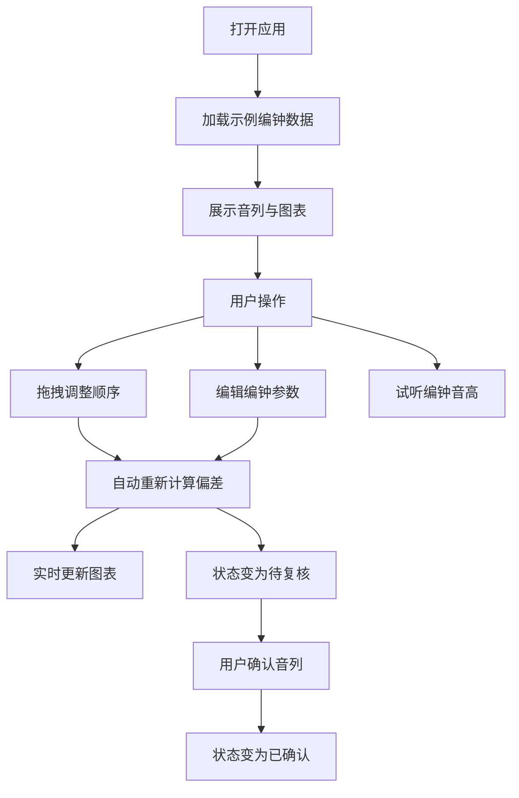

## 1. 产品概述

编钟音列分析系统是一款面向音乐考古研究、乐器制作调校的专业工具，用于数字化记录编钟音列数据、分析实测频率偏差、辅助调整编钟排列顺序，以达到理想的音律效果。

- 核心目标：提供直观高效的编钟音高分析与排列调整平台
- 目标用户：音乐考古学者、编钟制作师、民族音乐研究者
- 产品价值：将传统编钟调音工作数字化、可视化，提升音列分析效率与准确度

## 2. 核心功能

### 2.1 用户角色

| 角色 | 登录方式 | 核心权限 |
|------|----------|----------|
| 研究人员 | 本地应用 | 录入数据、分析音列、调整排列、导出结果 |

### 2.2 功能模块

1. **音列管理区**：可拖拽的编钟音列展示，支持调整编钟排列顺序
2. **编钟信息编辑**：录入和编辑目标频率、实测频率、重量、敲击位置
3. **音分偏差计算**：自动计算音分偏差，超限突出显示
4. **图表分析区**：频率曲线图、偏差分布图
5. **音频试听**：通过 Web Audio API 播放编钟音高
6. **确认复核机制**：音列调整后需重新确认

### 2.3 页面详情

| 页面名称 | 模块名称 | 功能描述 |
|----------|----------|----------|
| 主工作台 | 音列拖拽区 | 横向排列的音位槽，每个音位放置一口编钟，支持拖拽排序 |
| 主工作台 | 编钟编辑面板 | 选中编钟后展示详细信息表单，可编辑各项参数 |
| 主工作台 | 频率曲线图 | 展示整组编钟的目标频率与实测频率对比曲线 |
| 主工作台 | 偏差分布图 | 展示各编钟音分偏差的柱状分布 |
| 主工作台 | 状态控制条 | 显示音列确认状态、复核提醒、允许偏差设置 |

## 3. 核心流程

用户打开应用后，默认展示一组示例编钟数据。用户可以：
1. 拖拽编钟调整音列顺序
2. 点击选中编钟，在编辑面板修改参数
3. 实时查看频率曲线和偏差分布的变化
4. 音列调整后，确认状态自动变为"待复核"
5. 确认无误后可标记为"已确认"
6. 点击播放按钮试听编钟音高

## 4. 用户界面设计

### 4.1 设计风格

- **整体风格**：典雅专业的研究工具风格，融合青铜编钟的文化质感与现代数据可视化的清晰感
- **主色调**：深青铜色 `#5C4A3D` 为主，暖金色 `#C9A962` 为强调色
- **背景色**：深木色 `#2A221D` 搭配浅米色内容区 `#F5F0E8`
- **状态色**：正常用深绿色 `#4A7C59`，超限警告用朱红色 `#B8453A`
- **按钮风格**：微圆角矩形，青铜质感边框，悬停有光泽效果
- **字体**：标题使用衬线体（Noto Serif SC）体现文化底蕴，正文使用现代无衬线体保证可读性
- **布局风格**：三栏式布局，左侧音列区、中间编辑区、右侧图表区
- **图标风格**：线性图标搭配金色点缀，精致简洁

### 4.2 页面设计概述

| 页面名称 | 模块名称 | UI 元素 |
|----------|----------|---------|
| 主工作台 | 音列拖拽区 | 横向滚动的音位槽卡片，编钟以青铜钟形图标表示，显示频率与偏差值 |
| 主工作台 | 编钟编辑面板 | 卡片式表单，分组展示基本信息、频率参数、物理参数 |
| 主工作台 | 频率曲线图 | 平滑折线图，双折线对比目标/实测频率，背景有网格 |
| 主工作台 | 偏差分布图 | 柱状图，零轴居中，正负偏差分色显示，超限柱高亮 |
| 主工作台 | 状态条 | 底部固定状态栏，显示确认状态、偏差容限设置、操作按钮 |

### 4.3 响应式

- 桌面端优先设计，三栏并列布局
- 中等屏幕：图表区折叠到下方
- 移动端：纵向堆叠布局，音列改为纵向排列
- 拖拽操作支持触屏手势

## 5. 业务规则

### 5.1 数据约束

- 每个音位只能放置一口编钟
- 目标频率、实测频率、重量必须大于零
- 敲击位置可选择：正鼓、右鼓、左鼓、钲部
- 音分偏差范围默认 ±50 音分，可自定义

### 5.2 音分计算

音分偏差公式：`偏差(音分) = 1200 × log₂(实测频率 / 目标频率)`

### 5.3 状态流转

- 初始状态：已确认（基于默认数据）
- 任何参数修改或顺序调整 → 待复核
- 用户点击"确认音列" → 已确认
