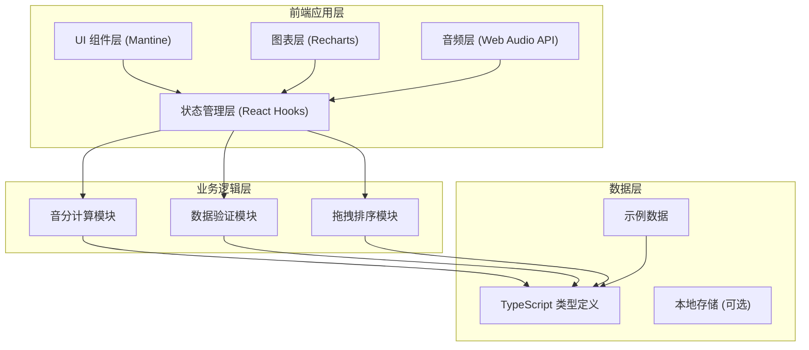
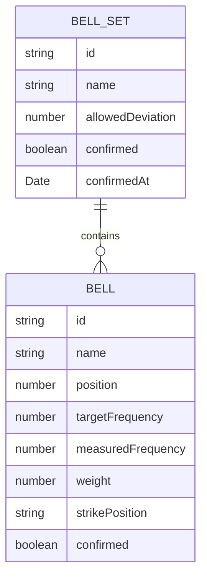

## 1. 架构设计



## 2. 技术描述

- **前端框架**：React 18 + TypeScript
- **构建工具**：Vite 5
- **UI 组件库**：Mantine v7
- **图表库**：Recharts 2
- **拖拽库**：@dnd-kit/core + @dnd-kit/sortable
- **样式方案**：Mantine 内置 CSS-in-JS
- **音频处理**：Web Audio API (原生)
- **状态管理**：React useState/useReducer (轻量场景)

## 3. 目录结构

```
src/
├── types/              # 类型定义
│   └── bell.ts         # 编钟相关类型
├── utils/              # 工具函数
│   ├── cents.ts        # 音分计算
│   └── validation.ts   # 数据验证
├── hooks/              # 自定义 Hooks
│   ├── useBellSet.ts   # 编钟音列状态管理
│   └── useAudio.ts     # 音频播放 Hook
├── components/         # 组件
│   ├── BellRack/       # 音列拖拽区
│   ├── BellEditor/     # 编钟编辑面板
│   ├── FrequencyChart/ # 频率曲线图
│   ├── DeviationChart/ # 偏差分布图
│   └── StatusBar/      # 状态控制条
├── data/               # 示例数据
│   └── mockBells.ts
├── App.tsx             # 主应用
├── main.tsx            # 入口文件
└── theme.ts            # Mantine 主题配置
```

## 4. 数据模型

### 4.1 数据模型定义



### 4.2 TypeScript 类型定义

```typescript
// 敲击位置
type StrikePosition = '正鼓' | '右鼓' | '左鼓' | '钲部';

// 编钟
interface Bell {
  id: string;
  name: string;
  position: number;      // 音位序号
  targetFrequency: number; // 目标频率 (Hz)
  measuredFrequency: number; // 实测频率 (Hz)
  weight: number;        // 重量 (kg)
  strikePosition: StrikePosition; // 敲击位置
}

// 音列状态
interface BellSetState {
  bells: Bell[];
  selectedBellId: string | null;
  confirmed: boolean;
  confirmedAt: Date | null;
  allowedDeviation: number; // 允许偏差 (音分)
}

// 音分偏差计算结果
interface DeviationResult {
  cents: number;
  isOutOfRange: boolean;
  direction: 'sharp' | 'flat' | 'equal';
}
```

## 5. 核心算法

### 5.1 音分偏差计算

```
音分偏差 = 1200 × log₂(实测频率 / 目标频率)
```

当偏差绝对值 > 允许偏差时，判定为超限。

### 5.2 拖拽排序

使用 @dnd-kit 实现横向拖拽排序，确保每个音位只能有一口编钟。

## 6. 主题配置

基于 Mantine 的主题系统，定制青铜风格主题：
- 主色调：深青铜、暖金色
- 字体：Noto Serif SC（标题）+ 系统无衬线（正文）
- 阴影和边框：金属质感渐变
